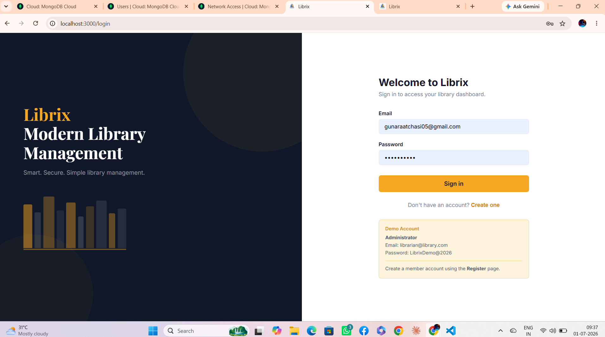
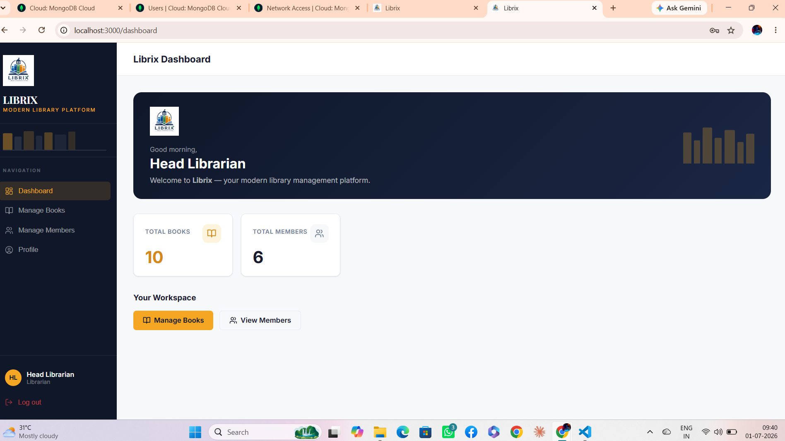
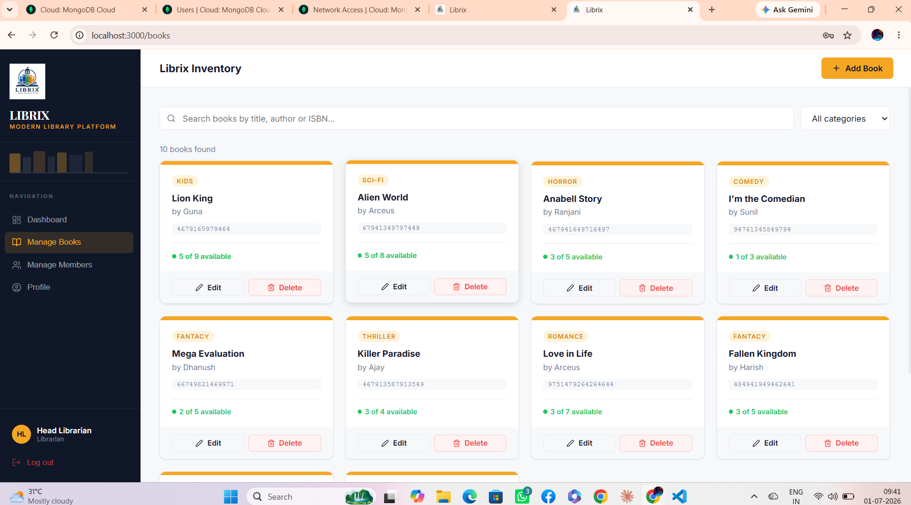
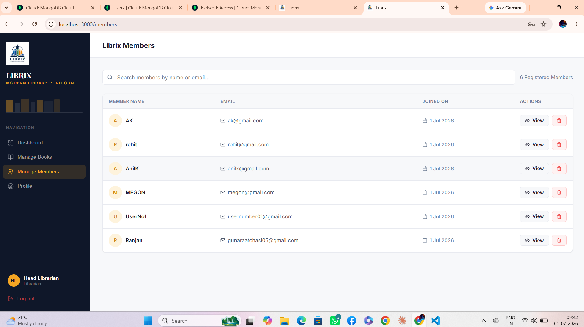
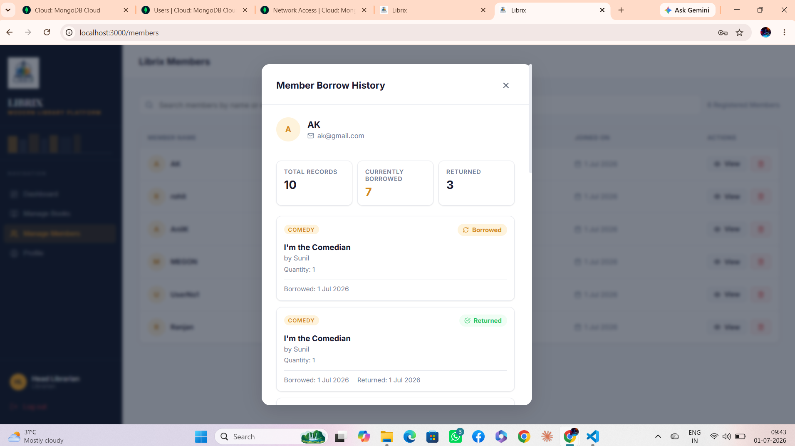
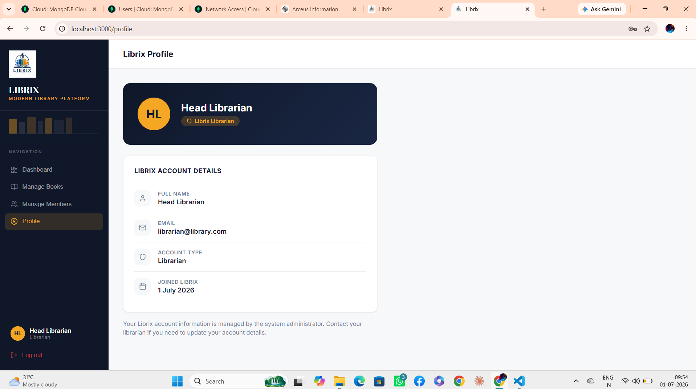
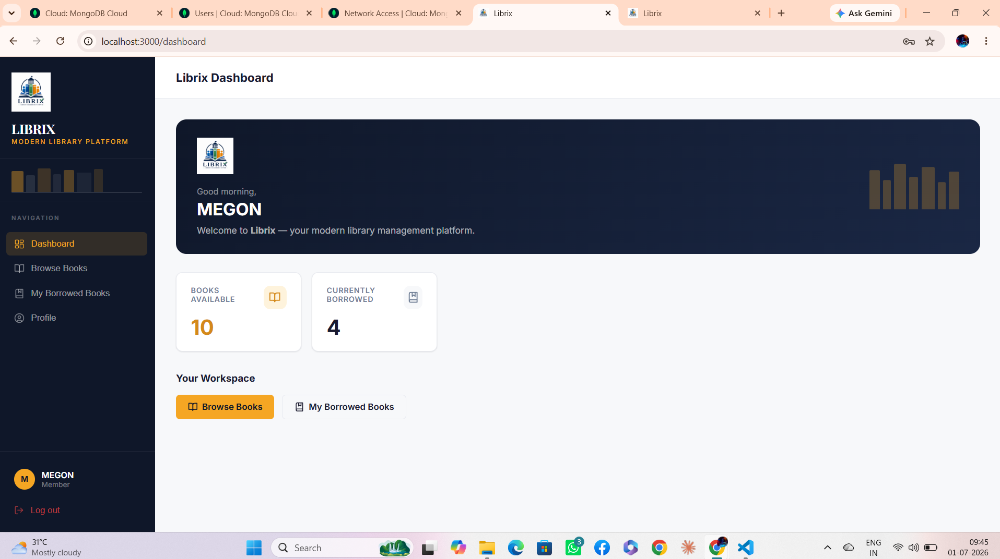
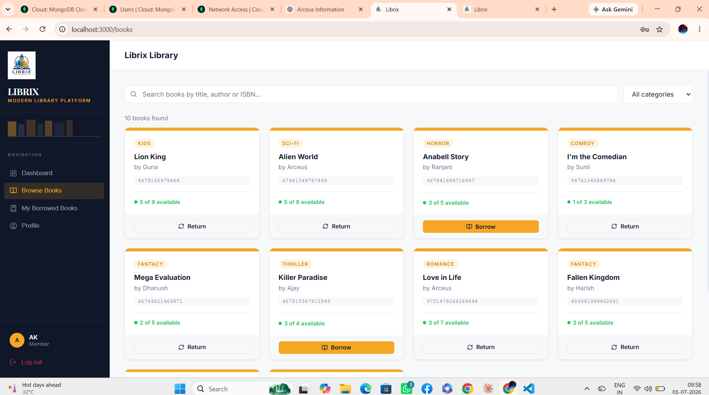
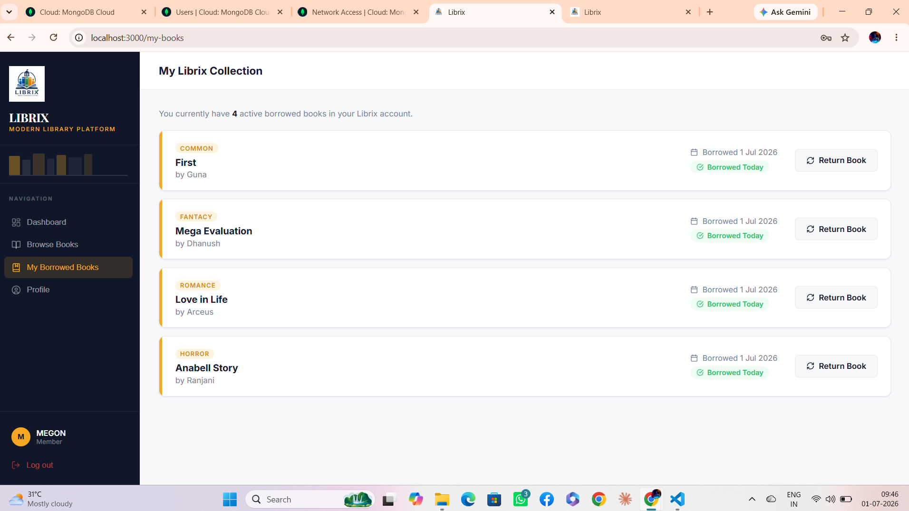
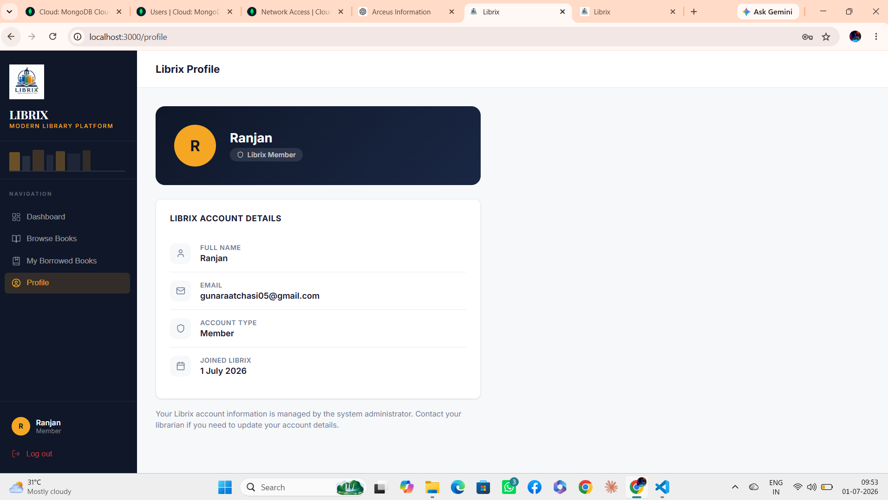

# 📚 Librix

<p align="center">
  
</p>

<h3 align="center">
Modern Library Management Platform
</h3>

<p align="center">
A modern full-stack Library Management Platform built using the MERN Stack.
</p>

<p align="center">


</p>

---

# 🌟 Overview

Librix is a modern full-stack Library Management Platform designed for libraries to efficiently manage books, members, borrowing activities, and inventory.

The platform provides secure authentication, role-based authorization, an intuitive dashboard, and a clean modern interface for both librarians and members.

---

# 🚀 Live Demo

### Frontend

https://librix-library-management-system.vercel.app/

### Backend API

https://librix-library-management-system.onrender.com/api/health

---

# 📸 Application Screenshots

## Login



---

## Librarian Dashboard



---

## Manage Books



---

## Manage Members



---

## Member Borrow History



---

## Librarian Profile



---

## Member Dashboard



---

## Browse Books



---

## My Books



---

## Member Profile



---

# ✨ Features

## Authentication

- Secure JWT Authentication
- Refresh Token Support
- Password Encryption using bcrypt
- Role-Based Authorization
- Protected Routes

---

## Librarian Features

- Dashboard Overview
- Add Books
- Update Books
- Delete Books
- Manage Members
- View Member Borrow History
- Monitor Book Inventory

---

## Member Features

- Register Account
- Login Securely
- Browse Books
- Search Books
- Filter by Category
- Borrow Books
- Return Books
- View Borrowed Books
- Personal Dashboard
- Profile Management

---

## UI Features

- Responsive Design
- Modern Dashboard
- Professional Sidebar
- Toast Notifications
- Pagination
- Search
- Filtering
- Empty States
- Loading Animations

---

# 🛠 Tech Stack

## Frontend

- React.js
- React Router DOM
- Axios
- React Hot Toast
- Lucide React
- CSS3

---

## Backend

- Node.js
- Express.js
- MongoDB Atlas
- Mongoose
- JWT Authentication
- bcryptjs
- dotenv

---

## Tools

- Git
- GitHub
- MongoDB Atlas
- Postman
- VS Code

---

# 📂 Project Structure

```
LibraryManagementSystem
│
├── backend
│   ├── controllers
│   ├── middleware
│   ├── models
│   ├── routes
│   ├── services
│   ├── validators
│   ├── utils
│   └── server.js
│
├── frontend
│   ├── public
│   ├── src
│   │   ├── api
│   │   ├── components
│   │   ├── context
│   │   ├── pages
│   │   └── App.js
│
├── screenshots
│
└── README.md
```

---

# ⚙ Installation

## Clone Repository

```bash
git clone https://github.com/DhanushArceus05/librix-library-management-system.git

cd LibraryManagementSystem
```

---

# Backend Setup

```bash
cd backend

npm install
```

Create `.env`

```env
PORT=5000

DATABASE_URL=YOUR_MONGODB_CONNECTION_STRING

JWT_SECRET=YOUR_SECRET

JWT_REFRESH_SECRET=YOUR_REFRESH_SECRET

JWT_EXPIRES_IN=1d

JWT_REFRESH_EXPIRES_IN=7d

NODE_ENV=development
```

Run Seeder

```bash
npm run seed
```

Start Backend

```bash
npm run dev
```

---

# Frontend Setup

```bash
cd frontend

npm install

npm start
```

Frontend

```
http://localhost:3000
```

Backend

```
http://localhost:5000
```

---

# 🔐 Demo Credentials

## Librarian

Email

```
librarian@library.com
```

Password

```
LibrixDemo@2026
```

---

## Member

Create a new account using the Register page.

---

# 📬 API Documentation

Complete backend API documentation is available inside

```
backend/README.md
```

Postman Collection

```
backend/postman_collection.json
```

---

# 🚀 Future Improvements

- Email Notifications
- Book Reservation System
- Fine Management
- QR Code Integration
- Barcode Scanner Support
- Analytics Dashboard
- Dark Mode
- Multi-Library Support
- Mobile Application

---

# 👨‍💻 Author

**Dhanush M**

GitHub

```
https://github.com/DhanushArceus05
```

LinkedIn

```
https://www.linkedin.com/in/dhanush-m-arceus05
```

---

# ⭐ Support

If you like this project,

please consider giving it a ⭐ on GitHub.

---

# 📄 License

This project is licensed under the MIT License.